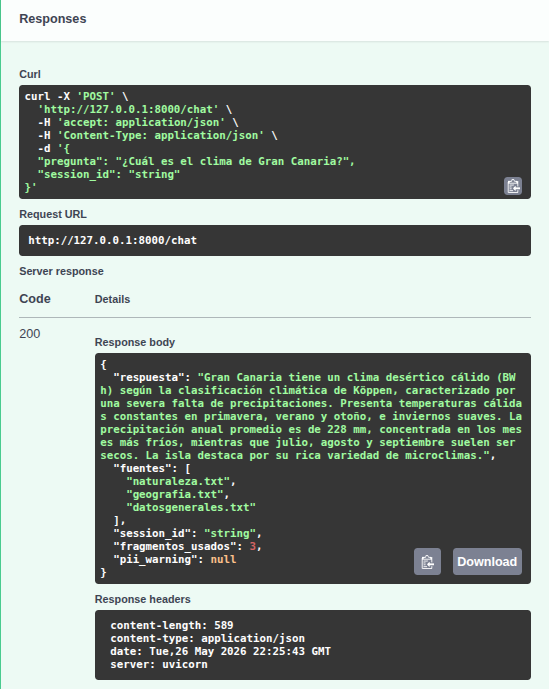
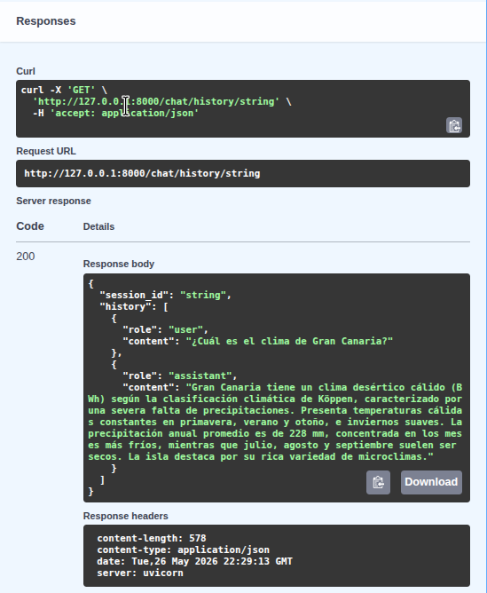

# Chatbot RAG — Guía de Gran Canaria

Chatbot que responde preguntas sobre Gran Canaria usando RAG (Retrieval-Augmented Generation). Recupera fragmentos relevantes de documentos propios y los usa como contexto para generar respuestas precisas. Funciona 100% en local con Ollama.

Los documentos del corpus están extraídos del [artículo de Wikipedia sobre Gran Canaria](https://es.wikipedia.org/wiki/Gran_Canaria), reorganizados por temática en cinco ficheros independientes.

## Stack

- **Embeddings** — `bge-m3` via Ollama (local)
- **LLM** — `qwen3:14b` via Ollama (local)
- **Vector store** — ChromaDB
- **API** — FastAPI

## Requisitos previos

- [Ollama](https://ollama.com) instalado y corriendo
- Modelos descargados:
  ```bash
  ollama pull bge-m3
  ollama pull qwen3:14b
  ```

## Instalación

```bash
git clone <url-del-repo>
cd lab-web-py-chatbot-rag
python -m venv venv
source venv/bin/activate
pip install -r requirements.txt
cp .env.example .env
```

## Configuración

El fichero `.env` ya viene preconfigurado para Ollama en local:

```
OLLAMA_URL=http://localhost:11434/v1
OLLAMA_MODEL=qwen3:14b
OLLAMA_EMBED_MODEL=bge-m3
```

Cambia `OLLAMA_MODEL` si prefieres usar otro modelo.

## Indexar los documentos

Ejecutar una sola vez antes de arrancar la API:

```bash
python indexer.py
```

Salida esperada:

```
=======================================================
  Indexador de documentos RAG
=======================================================

  Indexando 5 documentos...

  OK  atractivos.txt                             1 chunks  [ocio]
  OK  datosgenerales.txt                         1 chunks  [general]
  OK  geografia.txt                              1 chunks  [medio_ambiente]
  OK  historia.txt                               1 chunks  [historia]
  OK  naturaleza.txt                             1 chunks  [medio_ambiente]

=======================================================
  Documentos indexados : 5
  Chunks totales       : 5
  Modelo embeddings    : bge-m3 (local, coste $0)
  ChromaDB             : ./chroma_db/docs
=======================================================
```

## Arrancar la API

```bash
uvicorn api:app --reload
```

Swagger UI disponible en `http://localhost:8000/docs`.

## Endpoints

| Método | Ruta | Descripción |
|--------|------|-------------|
| `POST` | `/chat` | Envía una pregunta y obtiene respuesta con fuentes |
| `GET`  | `/chat/history/{session_id}` | Historial de una sesión |
| `GET`  | `/documentos` | Lista de documentos indexados |

### POST /chat

```json
{
  "pregunta": "¿Cuál es el clima de Gran Canaria?",
  "session_id": "usuario-1"
}
```

Respuesta:

```json
{
  "respuesta": "Gran Canaria tiene un clima desértico cálido...",
  "fuentes": ["naturaleza.txt", "geografia.txt", "datosgenerales.txt"],
  "session_id": "usuario-1",
  "fragmentos_usados": 3,
  "pii_warning": null
}
```

## Medidas de seguridad

- Rate limiting: máximo 10 peticiones por minuto por IP
- Validación: longitud máxima de pregunta 500 caracteres
- Logging de cada llamada sin registrar el contenido de los documentos
- Detección de datos personales (email, DNI/teléfono) con aviso en la respuesta

## Capturas

### POST /chat


### GET /chat/history/{session_id}


### GET /documentos

